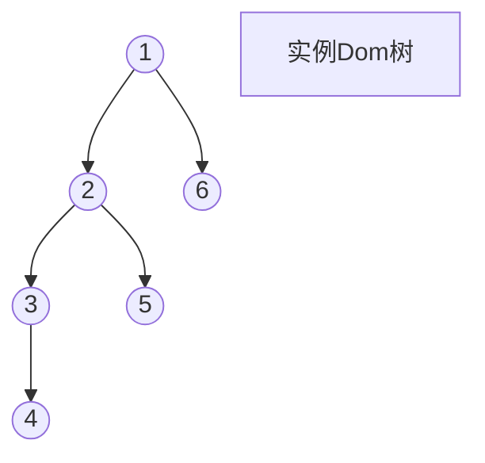

<!--
 * @Author: hy
 * @Date: 2024-01-18 13:03:02
 * @LastEditors: hy
 * @Description:
 * @LastEditTime: 2024-01-19 20:01:06
 * @FilePath: /mini-react/docs/3.任务调度和fiber还有统一提交.md
 * Copyright 2024 hy, All Rights Reserved.
-->

3.任务调度 和 fiber 还有 统一提交

我们现在是全量渲染我们的 dom 树，当需要渲染的节点过多时候，页面会就会卡顿

我们可以需要把这个需要渲染的 dom 树进行拆分，在不同的（浏览器空闲时期执行的任务）任务中依次进行渲染，这样我们可以使用链表的形式依次执行这个渲染流程

现在我们需要去指定渲染 dom 树转链表的规则



树转链表的规则：

根节点 1,
找到 1 的子节点 2，
找到 2 的子节点 3，
找到 3 的子节点 4，
找不到 4 的子节点，找不到 3 的子节点，找到 3 的兄弟节点 5，
找不到 5 的子节点，找不到 5 的兄弟节点，找到 2 的兄弟节点 6,
找不到 6 的子节点，找到 6 的父节点 1

最后转成的链表为：
1->2->3->4->5->6->结束

---

### [mdn requestIdleCallback](https://developer.mozilla.org/zh-CN/docs/Web/API/Window/requestIdleCallback)

window.requestIdleCallback() 方法插入一个函数，这个函数将在浏览器空闲时期被调用。这使开发者能够在主事件循环上执行后台和低优先级工作，而不会影响延迟关键事件，如动画和输入响应。函数一般会按先进先调用的顺序执行，然而，如果回调函数指定了执行超时时间 timeout，则有可能为了在超时前执行函数而打乱执行顺序。

你可以在空闲回调函数中调用 requestIdleCallback()，以便在下一次通过事件循环之前调度另一个回调。

---

### 具体实现

```javascript
let nextWorkOfUnit = null;
/*******
 * @description:
 * @param {IdleDeadline} deadline
 * @return {*}
 */
function workLoop(deadline) {
  let shouldYield = false;
  while (!shouldYield && nextWorkOfUnit) {
    // 在执行完当前任务后返回新的任务
    nextWorkOfUnit = performWorkOfUnit(nextWorkOfUnit);
    shouldYield = deadline.timeRemaining() < 1;
  }
  // 执行下一个任务
  requestIdleCallback(workLoop);
}

function performWorkOfUnit(work) {
  if (!work.dom) {
    // 1. 创建我们的dom,给当前 work 赋值
    const dom = (work.dom =
      work.type === "TEXT_ELEMENT"
        ? document.createTextNode("")
        : document.createElement(work.type));

    // 2. 处理props
    Object.keys(work.props).forEach((key) => {
      if (key != "children") {
        dom[key] = work.props[key];
      }
    });

    work.parent.dom.append(dom);
  }

  console.log("performWorkOfUnit work ==>", work);

  // 3. 转换链表，设置好指针
  const children = work.props?.children;
  let prevChild = null; // 上一个节点
  children?.forEach((child, index) => {
    const newWork = {
      type: child.type,
      props: child.props,
      child: null,
      parent: work,
      sibling: null,
      dom: null,
    };
    if (index === 0) {
      work.child = newWork;
    } else {
      prevChild.sibling = newWork; // 兄弟节点
    }
    prevChild = newWork;
  });

  // 4. 返回下一个要执行的任务
  // 检查是否有子节点
  if (work.child) {
    return work.child;
  }
  // 检查是否有兄弟节点
  if (work.sibling) {
    return work.sibling;
  }
  // 返回父节点的子节点，当返回undefined 则结束
  return work.parent?.sibling;
}

requestIdleCallback(workLoop);

function render(el, container) {
  // 根节点
  nextWorkOfUnit = {
    dom: container,
    props: {
      children: [el],
    },
  };
}
```

#### 优化重构代码

```javascript
function createDom(type) {
  return type === "TEXT_ELEMENT"
    ? document.createTextNode("")
    : document.createElement(type);
}

function updateProps(el, props) {
  Object.keys(props).forEach((key) => {
    if (key !== "children") {
      el[key] = props[key];
    }
  });
}

function initChildren(fiber) {
  let prevFiber = null; // 上一个节点
  fiber.props?.children?.forEach((child, index) => {
    const newFiber = {
      type: child.type,
      props: child.props,
      dom: null,
      child: null,
      sibling: null,
      parent: fiber,
    };
    if (index === 0) {
      fiber.child = newFiber; // 兄弟节点
    } else {
      prevFiber.sibling = child;
    }
    prevFiber = newFiber;
  });
}

let nextWorkOfUnit = null;
/*******
 * @description:
 * @param {IdleDeadline} deadline
 * @return {*}
 */
function workLoop(deadline) {
  let shouldYield = false;
  // 当前任务还没有结束，有下一个节点要渲染
  while (!shouldYield && nextWorkOfUnit) {
    // 在执行完当前任务后返回新的任务
    nextWorkOfUnit = performWorkOfUnit(nextWorkOfUnit);
    shouldYield = deadline.timeRemaining() < 1;
  }
  requestIdleCallback(workLoop);
}

function performWorkOfUnit(fiber) {
  if (!fiber.dom) {
    // 1. 创建我们的dom,给当前 work 赋值
    const dom = (fiber.dom = createDom(fiber.type));

    // 2. 处理props
    updateProps(dom, fiber.props);

    // append dom
    fiber.parent.dom.append(dom);
  }

  // 3. 转换链表，设置好指针
  initChildren(fiber);

  // 4. 返回下一个要执行的任务
  // 检查是否有子节点
  if (fiber.child) {
    return fiber.child;
  }
  // 检查是否有兄弟节点
  if (fiber.sibling) {
    return fiber.sibling;
  }
  // 返回父节点的子节点，当返回undefined 则结束
  return fiber.parent?.sibling;
}

requestIdleCallback(workLoop);

function render(el, container) {
  console.log("render el =>", el);
  console.log("render container =>", container);

  // 根节点
  nextWorkOfUnit = {
    dom: container,
    props: {
      children: [el],
    },
  };
}
```

### 统一提交

我们虽然把需要渲染的dom树拆分到不同的任务中执行，但是每个（浏览器空闲时期执行的任务）任务的执行时间都不一样，很有可能渲染完前几个节点已经显示了，完后一直没有空闲时间，很久之后才会渲染后面的节点，所以我们要依次渲染，最后渲染完统一插入dom中，这时候我们就要计算渲染是否结束，结束后统一添加到页面中

关键点：

1. 什么时候代表渲染结束
2. 在根节点上统一插入节点
